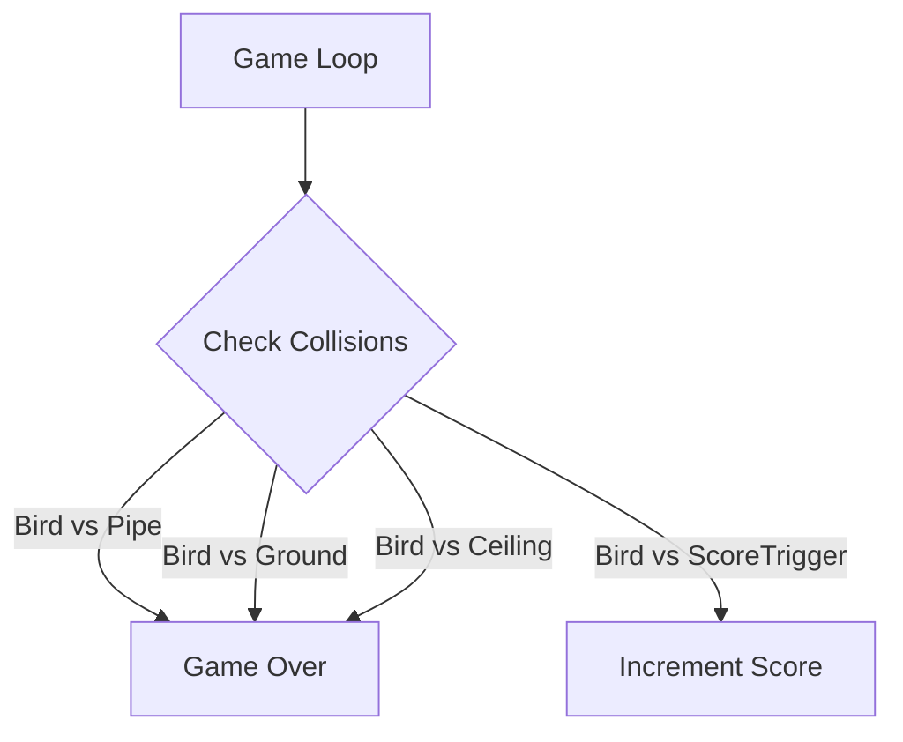

# Game Mechanics & Physics

This project uses **Phaser 3**, a powerful 2D game framework, to handle the game loop, rendering, and physics.

## Physics System

We use Phaser's **Arcade Physics** system, which is lightweight and perfect for simple 2D games like Flappy Bird.

### Collision Detection
Collision detection is handled using **AABB (Axis-Aligned Bounding Box)** logic. The game checks for overlaps between the bird's bounding box and other objects.

*   **Bird**: A dynamic body affected by gravity (`1000`).
*   **Pipes**: Kinematic bodies that move left (`velocity.x = -200`) but are not affected by gravity.
*   **Ground**: A static body that the bird can collide with.

## The Game Loop

The game runs at approximately **60 frames per second (FPS)**. However, for AI training, we implement **Frame Skipping**.

### Frame Skipping
To speed up training and stabilize inputs, the AI doesn't make a decision every single frame.

1.  **Skip 5 frames**: The game physics update normally, but the AI does nothing (repeats previous action or idles).
2.  **Act on 6th frame**: The AI observes the state, calculates a reward, and chooses an action.

This reduces the computational load and prevents the AI from "jittering" by reacting too fast to minor changes.

## Game Objects

| Object | Description | Physics Properties |
|--------|-------------|-------------------|
| **Bird** | The player/agent | Gravity: Y, Velocity: X/Y |
| **Pipe** | Obstacle | Velocity: X (Left), Immovable |
| **Score Trigger** | Invisible zone between pipes | Velocity: X (Left), Sensor (No collision response) |
