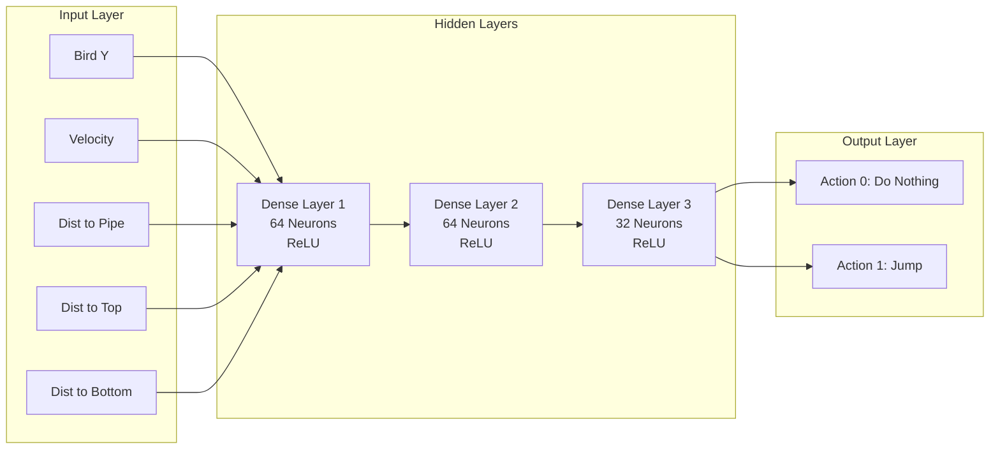

# Neural Network Architecture

The AI agent in this project uses a **Deep Q-Network (DQN)**, a type of reinforcement learning algorithm that combines Q-Learning with deep neural networks.

## Architecture Overview

The network takes the current state of the game as input and outputs the estimated Q-values for each possible action. The action with the highest Q-value is selected.



## Inputs (State Space)

The neural network receives 5 continuous values normalized to a range (mostly 0-1 or -1 to 1) to help the network converge faster.

| Input | Description | Normalization |
|-------|-------------|---------------|
| **Bird Y** | Vertical position of the bird | `y / 600` (Screen Height) |
| **Velocity** | Vertical speed of the bird | `clamp(velocity / 1000, -1, 1)` |
| **Dist to Pipe** | Horizontal distance to the next pipe | `(pipeX - birdX) / 800` |
| **Dist to Top** | Vertical distance to the top pipe's lower edge | `(birdY - topPipeY) / 600` |
| **Dist to Bottom** | Vertical distance to the bottom pipe's upper edge | `(bottomPipeY - birdY) / 600` |

## Outputs (Action Space)

The network outputs 2 values, representing the "Q-value" (expected future reward) for each action.

1.  **Do Nothing (0)**: The bird continues to fall due to gravity.
2.  **Jump (1)**: The bird flaps its wings and gains upward velocity.

## Implementation Details

The model is built using `tf.sequential()` in TensorFlow.js:

```javascript
const model = tf.sequential();
model.add(tf.layers.dense({ units: 64, inputShape: [5], activation: 'relu' }));
model.add(tf.layers.dense({ units: 64, activation: 'relu' }));
model.add(tf.layers.dense({ units: 32, activation: 'relu' }));
model.add(tf.layers.dense({ units: 2, activation: 'linear' }));
model.compile({ optimizer: 'adam', loss: 'meanSquaredError' });
```
