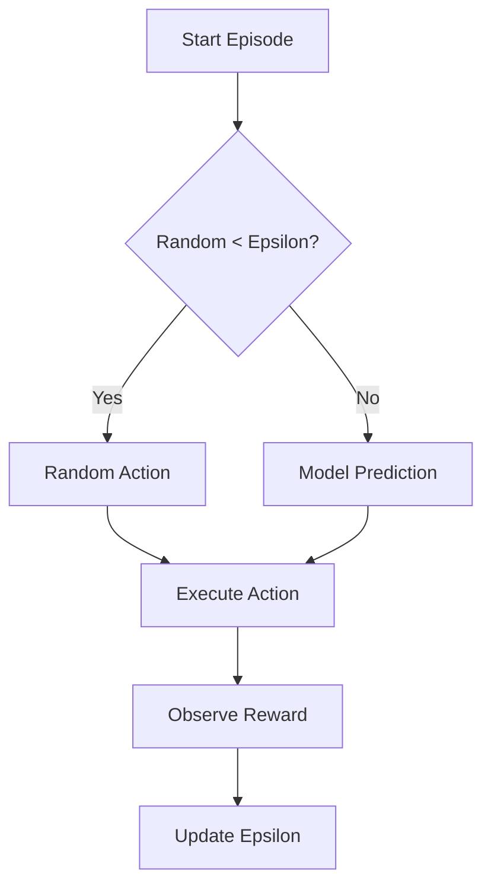

# Performance Metrics & Accuracy

In Reinforcement Learning (RL), "accuracy" isn't measured like in classification tasks (e.g., "99% correct"). Instead, we measure performance by the **Total Reward** accumulated per episode and the **Average Score** over time.

## The Reward Function

The agent learns by trying to maximize its cumulative reward. We define specific rewards and penalties to guide its behavior:

| Event | Reward | Reasoning |
|-------|--------|-----------|
| **Stay Alive** | `+0.1` (per frame) | Encourages the bird to survive as long as possible. |
| **Pass Pipe** | `+1.0` (implicit) | Accumulating "Stay Alive" rewards while passing pipes results in a high score. |
| **Flap (Jump)** | `-0.2` | Penalizes excessive flapping to encourage efficient movement and prevent "jittering" at the top of the screen. |
| **Death** | `-100` | A massive penalty for hitting a pipe, ground, or ceiling. This is the most critical signal for the AI to avoid. |

## Training Progress

### Epsilon-Greedy Strategy
The agent uses an **Epsilon-Greedy** strategy to balance exploration and exploitation.

*   **Exploration**: Taking random actions to discover new possibilities.
*   **Exploitation**: Using the trained neural network to make the best decision.

*   **Initial Epsilon**: `1.0` (100% random)
*   **Decay Rate**: `0.995` per episode
*   **Minimum Epsilon**: `0.01` (1% random)

As training progresses, `epsilon` decreases, meaning the agent relies more on what it has learned and less on random guesses.

## Measuring Success

We consider the model "successful" when:
1.  **Average Score** consistently increases.
2.  **Epsilon** has decayed to its minimum (`0.01`).
3.  The bird can survive indefinitely (or for a very long time) without crashing.
