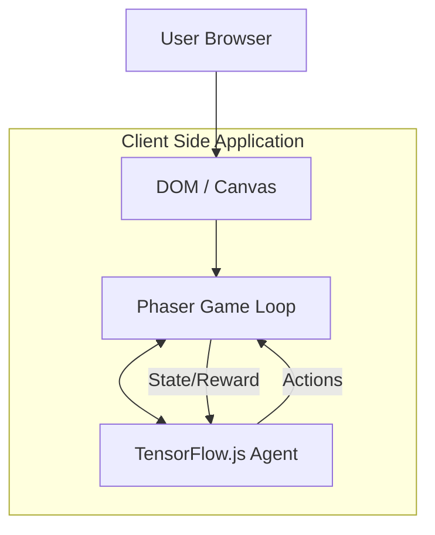

# Tech Stack Explained

This project combines modern web technologies to create a browser-based AI experiment.

## Core Technologies

### 1. Phaser 3 (Game Engine)
[Phaser](https://phaser.io/) is one of the most popular HTML5 game frameworks.
*   **Why we use it**: It handles the "heavy lifting" of game development—rendering sprites, managing scenes, and calculating physics. This allows us to focus on the AI logic.
*   **Key Features**: Scenes, Arcade Physics, Asset Loader.

### 2. TensorFlow.js (Machine Learning)
[TensorFlow.js](https://www.tensorflow.org/js) is a library for machine learning in JavaScript.
*   **Why we use it**: It allows us to run the neural network **directly in the browser**.
    *   **No Backend Required**: Everything runs on the client side.
    *   **GPU Acceleration**: It utilizes WebGL to accelerate math operations on the user's GPU.
    *   **Interactivity**: Users can watch the training happen in real-time.

### 3. Vite (Build Tool)
[Vite](https://vitejs.dev/) is a modern frontend build tool.
*   **Why we use it**: It provides an extremely fast development server with Hot Module Replacement (HMR). This makes the development cycle (code -> save -> see result) almost instant.

## Architecture Diagram

